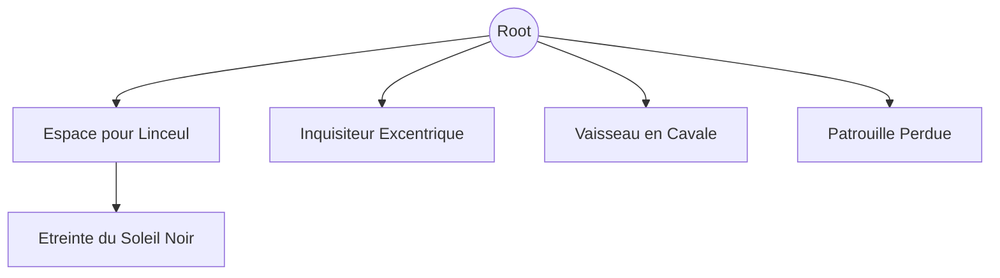

# Scénarios

## L'Espace pour Linceul
- Acroche : un vaisseau a émit un signal de détresse il y a quelques temps, mais personne n'y a prêter attention
- type : Rogue Trader
- source : web
- Graphe : [html version](https://iron-wolf.github.io/writing/w40k_jdr/espace_pour_linceul.html)
- Description : 
  - 010 : ...

## L'Etreinte du Soleil Noir (suite)
- Acroche : éradiquer les serviteurs du ver a éveillé l'attention de sombres pouvoirs
- type : Rogue Trader
- source : web
- Graphe : ...
- Description : ...

## Inquisiteur Excentrique
- Acroche : un Inquisiteur veut récupérer un objet inconnu
- type : Rogue Trader
- source : N/A
- Graphe : ...
- Description :
  - 2 parties (récupération / réstitution)
  - objet hérétique ?
  - Servirait l'Inquisiteur pour étendre sont influence sur le système

## Vaisseau en Cavale
- Acroche : un Space Hulk sort du warp et risque de s'écraser sur une planète
- type : Deathwatch
- source : N/A
- Graphe : ...
- Description : 
  - le vaisseau est endomager et ne peut pas s'arrêter
  - trouver le moyen de le détourner ou le détruire
  - sinon, infestation de la planète

## Patrouille Perdue (wip)
- Acroche : Perte de contacte avec une patrouille Astra Militarum
- type : Rogue Trader / Dark Heresy
- source : N/A
- Graphe : ...
- Description :
  - patrouille sacrifié au chaos ?
  - commandant corrompu ?

# Branches

