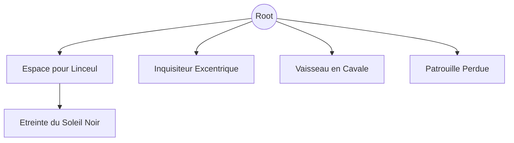

⚠️ Ressources pour le JDR Warth & Glory (2nd édition) ⚠️

# ToC
- [🎲 Tableaux](#tableaux-des-rencontres)
- [📚 Scénarios](#scénarios)

# Tableaux des rencontres

## Source
[tableaux de rencontres](https://www.dakkadakka.com/dakkaforum/posts/list/493584.page)  
[Excel ultra riche](https://docs.google.com/spreadsheets/u/0/d/1q0BGLDtKjNVaiZ7ikuCWqzY7rPeOP4tEt3p0Lon9dmM/htmlview#)  
[autre tables pratiques](https://chartopia.d12dev.com/collection/3291/)  
[map interactive ultra complète](https://jambonium.co.uk/40kmap)
[créateur de planète](http://darktrader.wikidot.com/random-tables)  
[planète en pixel art](https://deep-fold.itch.io/pixel-planet-generator)

## Résumé
| d20 | [espace](#espace-profond) | [spatioport](#station-et-spatioport) | [space hulk](#space-hulk) | [hive world](#hive-world) | [death world](#death-world) |
|-----|---------------------------|--------------------------------------|---------------------------|---------------------------|-----------------------------|
| 1   | Astéroides                | vaisseau spacial                     | Atmosphère résiduelle     | Nuage de gaz              | fruit violet !              |
| 2   | Traînée de comète         | Fournisseur                          | Zone de radiation         | Fournisseur               | fosse piégée                |
| 3   | objet perdu               | Noble perdu                          | Étrangetés Warp           | Gang Echer                | Robot de Terraformation     |
| 4   | vagues gravitationelles   | Gang                                 |                           |                           |                             |
| 5   | Bataille spatiale         |                                      |                           |                           | Arbre de fruits             |
| 6   | Nébuleuse                 |                                      | Équipement récupérable    | Entrée d'une tombe        | Perdu dans les champignons  |
| 7   | Trou de ver               |                                      |                           | Marchand riche            | Homme de tribu mutant       |
| 8   | Vaisseau marchand         |                                      |                           | Bar                       |                             |
| 9   | Station Spaciale          | Fonctionnaire Impériale              |                           | Cannibales mutants        | balise de détresse          |
| 10  | Space Hulk                | Aventurier à louer                   | Soute à marchandises      | Voyant aveugle            |                             |
| 11  |                           |                                      |                           | lieu unique               | Spores hallucinogènes       |
| 12  |                           |                                      | Rack d'armes              | Adeptus Arbites           | loot aléatoire              |
| 13  |                           | Adeptus Arbites                      |                           |                           | Tornade/tempête             |
| 14  |                           |                                      | Laboratoire               |                           | Vaisseau/Expédition perdue  |
| 15  | Vaisseau Noir             | Cadavre                              |                           |                           | Traité impérial             |
| 16  | Vaisseau impérial         | Taxe de sortie                       |                           | faiseurs de rumeurs       |                             |
| 17  | Exploration               | Pickpocket                           | Explorateurs              |                           |                             |
| 18  | Disfonctionnement         | Vaisseau d'aristocrate               | Chambre de stase active   | Tremblement de ruche      |                             |
| 19  | Action d'abordage         | Mission aléatoire                    | Xeno aléatoire            |                           |                             |
| 20  | signal de détresse        |                                      |                           |                           |                             |

### Espace Profond
1. **Astéroides :** le Navigator fait un jet d'`Agilitée`, sinon
- 1 : les scans indiquent que le champ d'astéroide est composé d'un mineral rare
- 2-5 : dégats mineurs au vaisseau
- 6 : une flotte ennemie prend l'équipage en embuscade
2. **Traînée de comète :** le Navigator fait un jet d'`Agilitée`, sinon les PJ sont `perturbé(2)` à cause des radiations
3. **objet perdu :**
  - 1-2 : cerceuil avec sceau de pureté, donne un équipement
  - 3-4 : mine orbitale désactivée à la dérive, le Navigator fait un jet d'`Agilitée` pour l'éviter
  - 5-6 : voir les "babioles" (p248)
4. **vagues gravitationelles :**
  - 1-2 : le Voidmaster suggère d'utiliser une lune voisine pour se propulser et atteindre sa déstination plus vite, le Navigator fait un jet d'`agilitée`
  - 3-4 : puit gravitationel ralentisant le temps et pouvant entrainer un retard d'une semaine sur le trajet
  - 5-6 : ...
5. **Bataille spatiale :** À chaque tour, le Pilote/Navigator doit réussir un test d'Initiative, sinon le vaisseau est touché par des bordées laser (les armures et les champs ne protègent pas). Un membre de l'équipage est désigné comme le tireur et peut faire un test de Compétence avec les Armes chaque tour pour toucher le vaisseau ennemi. Un coup détruit un fighter, deux coups détruisent un cutter, trois coups détruisent une brig et quatre coups détruisent une frigate. Les deux côtés tirent simultanément. Le Navigator peut tenter un abordage avec un jet d'Intelligence à -2, mais les PJ ne peuvent pas tirer et tenter un abordage le même tour.
6. **Nébuleuse :**
  - 1-2 : malgré le mutisme des Tech-Priest, votre Voidmaster fait une embardée. Vous évitez de justesse un vaisseau impérial dont le Navigator semble perdu. Vous leur donner les coordonnées d'un courant Warp. Vous avez le droit à une faveure
  - 3-4 : vous êtes perdu, le voyage est retardé de `1d6` jours
  - 5-6 : ...
7. **Trou de ver :** le Navigateur fait un Test d'`Intelligence` pour l'éviter, sinon le vaisseau est transporté
  - 1-2 : derrière la cicatrix maledictum
  - 3-4 : ...
  - 5-6 : ...
8. **Vaisseau marchand :**
  - 1 : un Libre Marchand, acompagné de Valkyrie. Attaque les PJ puis abandonne en pensant que c'était des "pirates", vu leur vaisseau
  - 2-3 : Libre Marchand amical
  - 4-5 : ...
  - 6 : vaisseau "Chartist" amical
9. **Station Spaciale**
  - 1-2 : ancienne station de minage restée accrochée à sont cailloux
  - 3-4 : station aléatoire
  - 5-6 : dock orbital
10. **Space Hulk :** 
  - 1-2-3 : space hulk détéctable de loin (pas de surprise)
  - 4-5 : apparition "soudaine" d'un amas qui risque de colisionner avec le vaisseau
  - 6 : le space hulk semble orienté pour s'écraser sur une planète voisine  
  _Un signal de détresse impérial retentit sur les auspex. Alors que vous vous demandez s'il faut enquêter ou non, le Voidmaster hurle et fait violemment basculer le vaisseau d'un côté. Le Seneshal suggère qu'il pourrait s'agir de la proue d'un marchand de classe Vagabond._
11. 
12. 
13. 
14. 
15. **Vaisseau Noir :**
  - 1-3 : vaisseau de l'Inquisition transportant un Inquisiteur, 1d6 Mercenaires Humains de base, et 1d6 psykers rebelles emprisonnés ou hôtes de démons (possédés) étant emmenés sur un monde proche
  - 4-5 : le vaisseau damande l'assistance des joueurs
  - 6 : le vaisseau exiger de les aborder (il y a un vaisseau à proximité transportant des psykers illégaux, ou autre...)
16. **Vaisseau impérial :**
  - 1-2 : Transporte soit un Inquisiteur, un Libre Marchand, ou un Adeptus Mechanicus, ainsi que `1d6` Humains Adeptus Arbites.
  - 3-4 : ...
  - 5 : vaisseau volé servant à de la contrebande (attaquer ou commercer)
  - 6 : découverte d'un échange clairement illégal entre 2 vaissseaux impériaux (échanger ou raporter l'hérésie à l'inquisition)
17. **exploration :**
  - 1-2 : cimetière de vaisseaux ou ruines xenos
  - 3-4 : interception d'une transmission chiffrée par les techno-priest
  - 5-6 : ...
18. **Disfonctionnement :**
  - 1 : surcharge sévère de plasmo-radiation triskadélique aux quadriconvertisseurs dinictariens du vaisseau. Le vaisseau doit dévier de sa trajectoire vers la planète habitable la plus proche et effectuer des réparations (`1d4` : 1=Hive World, 2=Port Spatial, 3=Death World, 4=Space Hulk)
  - 2-3 : une malaide se développe dans l'équipage (ou autre évènement interne)
  - 4-5 :
19. **Action d'abordage :**
  - 1-2 : une race xeno tente d'aborder le vaisseau (Tyranide, Ork, Eldar, ...)
  - 3-4 : des pirates humains se sont faufilé dans le vaisseau (depuis le dernier arrêt par exemple)
  - 5-6 : ...
20. **signal de détresse :**
  - 1 : vaisseau imperial corrompu ou xeno
  - 2 : double peine : lancer `2d20` sur cette table (ignorer cette entrée pour les 2 jets)
  - 3-6 : signal de détresse authentique. Le vaisseau est échoué dans l'espace

### Station et Spatioport
1. **Vaisseau spatial :** `1d6` vaisseaux docké à la station
2. **Fournisseur :** vend des articles courants (tout ce qui a une valeur de moins de 5 points), mais il a `1d6=1` de chance de posséder un objet rare
3. **Noble perdu :** Ramenez-le chez lui en sécurité pour une récompense de `2D20` deniers
4. **Gang :** 1 officier mercenaire et 1D4 mercenaires humains; cherches à "recruter". Créez-les comme l'armée impériale.
5. 
6. 
7. **Marchand riche :** 1D4 gardes humains (humains de base avec des épées et des autoguns) et des marchandises aléatoires valant 1D20 deniers impériaux
8. **Balise de détresse** portative s'active dans la région ; peut signifier n'importe quoi.
9. **Fonctionnaire de l'Autorité Portuaire Impériale :** humain de base avec 1D4 gardes voyous humains de base avec des épées et des laspistols. Il veut un pot-de-vin de 1d10 deniers ou il vous retardera de quitter la station spatiale pendant 6 jours, tout en veillant à ce que vos papiers soient en ordre. Un puissant Serviteur Impérial tel qu'un Inquisiteur ou un Juge peut contourner cela, mais la rumeur de qui il est se répandra alors à travers le port spatial, et toute tentative de subterfuge aura une chance permanente de -1 de réussite dans ce port spatial.
10. **Aventurier à louer :** Vous rencontrez un aventurier qui a besoin d'emploi. Vous pouvez l'embaucher en payant sa valeur en points en deniers, et également en l'équipant (il n'a pas d'équipement propre)
  - 1-3 : Humain de base
  - 4 : Nain de base
  - 5 : Champion Humain ou Nain
  - 6 : Type Exotique (1d6 : 1= Psyker de niveau I Humain de base, 2= Navigateur Humain de base, 3= Mutant Humain de base, 4= Aventurier Eldar, 5=Lancez à nouveau sur cette table, mais le personnage a un profil de Champion, 6= L'aventurier à la recherche d'un emploi est en fait un espion ou un renégat qui entraînera les personnages dans un piège pour ses amis)
11. 
12. 
13. **Adeptus Arbites :** interroge les PJ suspects
14. **Genestealer solitaire** en mission d'enlèvement
15. **Cadavre** avec des bijoux valant `1d20` deniers (`1d6<5` de chances que ce soit un piège posé par `1d6` gangsters, des humains de base, l'un ayant une mutation, épées).
16. **Taxe de sortie :** Elle est gardée par `1d4` gardes voyous humains de base avec des épées et des autoguns qui ne vous laisseront pas partir tant que vous n'aurez pas payé une taxe d'immigration de 1 denier chacun. De plus, ils vérifieront leur terminal et ne vous laisseront pas partir si vous êtes retenu par le Fonctionnaire de l'Autorité Portuaire Impériale (#9 ci-dessus). Un puissant Serviteur Impérial tel qu'un Inquisiteur ou un Juge peut contourner cela, mais la rumeur de qui il est se répandra alors à travers le port spatial, et toute tentative de subterfuge aura une chance permanente de -1 de réussite dans ce port spatial.
17. **Pickpocket :** Un membre aléatoire de votre groupe doit faire un test d'`Initiative`
  - si la victime obtient un score inférieur à l'Initiative, le voleur (un Humain de base) est attrapé
  - s'il obtient un score supérieur à l'Initiative, le voleur s'enfuit avec un objet aléatoire
  - s'il obtient exactement le même score que l'Initiative, le groupe voit le voleur juste au moment où il se faufile dans une ruelle, et doit le poursuivre s'ils veulent récupérer l'objet aléatoire qu'il a volé
18. **Vaisseau d'aristocrate :** Vaisseau spatial de plaisance pour les humains zélés
  - 1-2 : Libre Marchand
  - 3 : Adeptus Mechanicus
  - 4 : Noble Impérial
  - 5 : Inquisiteur
  - 6 : Renégat du Chaos Secret (dans ce cas, l'équipage est remplacé par sa bande de guerre déguisée).
19. **Mission aléatoire**
20. ..

### Space Hulk
1. **Atmosphère résiduelle :** En forçant cette porte, les joueurs doivent faire des tests de Force ou être projetés en arrière dans la pièce précédente, et subir une blessure
2. **Zone de radiation :** Les scanners d'énergie détecteront facilement cela, mais si les personnages passent à travers cette pièce, ils subissent une blessure. De plus, les personnages blessés par la radiation doivent réussir un jet de Sauvegarde de Robustesse ou subir une mutation aléatoire (p...)
3. **Étrangetés Warp :** `1D4` entités Warp de bas niveau
4. 
5. 
6. **Équipement récupérable :** Composants du vaisseau valant 1D10 deniers. Seul un Squat, un Adeptus Mechanicus ou un type de technicien similaire pourra l'identifier avec un jet d'`Intelligence`. Prend 1d6 tours pour récupérer.
7. 
8. 
9.
10. **Soute à marchandises :** 2D20 deniers de cargaison précieuse ; 1D4 armes, armures ou équipements aléatoires. `1d20=1` de chance d'objet magique. Lancez 1d6 : 1=arme du chaos, 2=armure du chaos, 3=objets du chaos, 4-5=grimoire contenant un sort d'invocation pour un démon aléatoire (les personnages lettrés peuvent faire un test d'Intelligence pour l'invoquer, puis un test de Volonté pour le contrôler, peut être invoqué une fois par semaine seulement), 6=arme démoniaque.
11. 
12. **Rack d'armes :** 1d6-4 objets exotiques ; 1d6-2 armes et armures aléatoires seront trouvées ici. 3% de chance d'arme magique. Lancez 1d6 : 1-3=arme du chaos, 4-5= psycanon et 1d100 balles, 6=arme démoniaque.
13. 
14. **Laboratoire :** 1d6 objets aléatoires. Seuls des objets autres que des armes seront trouvés ici.
15. 
16. ...
17. **Explorateurs :** `1d4` Explorateurs de base salvage l'épave. Ils peuvent négocier si le MJ le juge approprié.
18. **Chambre de stase active :**
  - 1 : un schéma SCS datant de l'hérésie d'Horus (recherché par l'Adeptus Mechanicus)
  - 2-3 : ...
  - 4-5 : ...
  - 6 : ...
19. **Xeno aléatoire :**
  - 1 : Hôte de démon
  - 2 : Nid de couvée : 1d3 Genestealers, 1d6 Tyranides de base, `1D4=1` de chance de Patriarche Genestealer.
  - 3-5 : `1d4` Mercenaires Humains de base (chacun a une mutation aléatoire) dirigés par un Space Marine Traître de base (mutation aléatoire et 50% de chance de pouvoirs psychiques)
  - 6 : Sensei
20. ...

### Hive World
1. **Nuage de gaz toxique d'une usine proche :** Jet de résistance ou -1 à toutes les actions pendant 1d3 jours
2. **Fournisseur :** vend des articles courants (tout ce qui a une valeur de moins de 5 points et tout ce qui est sur la table d'équipement), mais il a 15% de chance de posséder un objet rare aléatoire valant jusqu'à 20 points. La valeur en points se traduit en deniers impériaux sur une base de 1 pour 1.
3. **Gang Echer :**
4. **Gang :** 1 officier mercenaire et 1D4 mercenaires humains ; désespérés de "recruter". Créez-les comme l'armée impériale.
5. ...
6. **Entrée d'une tombe :** cf table de tombe
7. **Marchand riche**, 1D4 gardes voyous humains (humains de base avec des épées et des autoguns) et des marchandises aléatoires valant 1D20 deniers impériaux.
8. **Bar :** Vend de la nourriture et de la bière locale, 1d6 clients sont actuellement à l'intérieur, lancez 1d6 pour chacun
  - 1 : aventuriers à louer
  - 2 : mercenaires
  - 3 : marchands riches et leurs gardes
  - 4 : faiseurs de rumeurs
  - 5 : pickpockets
  - 6 : rencontres spéciales de n'importe quelle sorte
9. **Cannibale mutant :** 1d6 voyous humains (humains de base avec une mutation), et des armes improvisées.
10. **Voyant aveugle :** Répond à une (seule) question oui ou non pour 1D10 deniers, 60% d'exactitude. Le voyant est un psyker avec des pouvoirs spéciaux, donc la question peut porter sur n'importe quoi, et le MJ doit répondre honnêtement.
11. **lieu unique :**
  - 1-2 : Manufactorum
  - 3-4 : Librarium
  - 5-6 : ...
12. **Adeptus Arbites :** interrogez les PJ suspects
13. ...
14. **Cadavre** avec des bijoux valant `1D20` deniers (`1d6<5` de chances que ce soit un piège posé par `1d6` gangsters, des humains de base, l'un ayant une mutation, épées).
15. ...
16. **Guilde des faiseurs de rumeurs :** Répond aux questions concernant la zone locale seulement pour `1d6` deniers chacun, 80% d'exactitude.
17. ...
18. **Tremblement de ruche :** Sauvegarde d'initiative ou coincé sous les décombres; PJ et PJ qui aide lance `1D6=1` de chance de se dégager (faciliter le jet à chaque tour); Lancez `1D6=1` de rencontre chaque tour tant qu'il y a un PJ coincé, ne compte que si rencontre hostile (indiquant un piège).
19. **Taxe de sortie :** Elle est gardée par 1D4 gardes voyous humains (humains de base avec des épées et des autoguns) qui ne vous laisseront pas partir tant que vous n'aurez pas payé une taxe d'émigration de 1 denier chacun.
20. ...

### Death World
1. **Ne mangez pas le fruit violet ! :** Chaque PJ fait un jet d'Intelligence ou subit une blessure
2. **fosse piégée :** Jet de Sauvegarde d'Initiative ou tombe dedans pour `2D10` points de dégâts.
3. **Ancien Robot de Terraformation :** Maintenant fou ; identifie les PJ comme des animaux dangereux
4. **Homme de tribu :** Chef en tant que Héros Mineur Humain, et `1D4` Champions Humains, armes improvisées et arcs uniquement, peut être négocié avec un jet de Sang-froid si abordé avec précaution
5. **Arbre de fruits:** jet d'Intelligence pour analyser le fruit
   - 1-2 : doses de narcotiques
   - 3-4 : ...
   - 5-6 : ...
6. **Perdu dans les champignons :** Le chef (seul) fait un jet contre l'Intelligence chaque jour pour que la bande trouve son chemin, sinon, elle continue de errer dans une direction aléatoire
7. **Homme de tribu mutant :** `1d6` Humains de base (une mutation chacun), armes improvisées seulement.
8. **Balise de détresse :** signal détécté dans la région; peut signifier n'importe quoi.
9. **Pillards Orks :** 1d6, équipés de manière aléatoire.
10. **charge de bétail :** Tous les personnages font un jet de Sauvegarde d'Initiative ou sont piétinés
11. **Spores hallucinogènes :** Sauvegarde contre le Sang-froid ou blesse tous les personnages pendant `1d6` tours.
12. **loot aléatoire** 
  - 1-2 : Noeud de Krysospine valant `2D20` deniers
  - 3-4 : ...
  - 5-6 : ...
13. **Tornade/tempête :** Sauvegarde d'Initiative ou emporté de 4d6" dans une direction aléatoire et subit 2d6 points de dégâts. Les personnages emportés hors du plateau (plus de 17") sont hors de contact et font une rencontre séparée le lendemain
14. **Vaisseau/Expédition perdue :**
15. **Traité impérial :**
  - 1 : le monde ne peut plus être sauvé et doit être rasé (Exterminatus)
  - 2-3 : ...
  - 4-5 : ...
  - 6 : ...
16. 
17. 
18. 
19. 
20. 

# Scénarios

## L'Espace pour Linceul
- Acroche : un vaisseau a émis un signal de détresse il y a quelque temps, mais personne n'y a prêté attention
- type : Rogue Trader
- source : web
- Graphe : [html version](https://iron-wolf.github.io/writing/w40k_jdr/espace_pour_linceul.html)
- Description : 
  - 010 : ...

## L'Etreinte du Soleil Noir (suite)
- Acroche : éradiquer les serviteurs du ver a éveillé l'attention de sombres pouvoirs
- type : Rogue Trader
- source : web
- Graphe : ...
- Description : ...

## Inquisiteur Excentrique
- Acroche : un Inquisiteur veut récupérer un objet inconnu
- type : Rogue Trader
- source : N/A
- Graphe : ...
- Description :
  - 2 parties (récupération / réstitution)
  - objet hérétique ?
  - Servirait l'Inquisiteur pour étendre sont influence sur le système

## Vaisseau en Cavale
- Acroche : un Space Hulk sort du warp et risque de s'écraser sur une planète
- type : Deathwatch
- source : N/A
- Graphe : ...
- Description : 
  - le vaisseau est endomager et ne peut pas s'arrêter
  - trouver le moyen de le détourner ou le détruire
  - sinon, infestation de la planète

## Patrouille Perdue (wip)
- Acroche : Perte de contacte avec une patrouille Astra Militarum
- type : Rogue Trader / Dark Heresy
- source : N/A
- Graphe : ...
- Description :
  - patrouille sacrifié au chaos ?
  - commandant corrompu ?

# Branches

